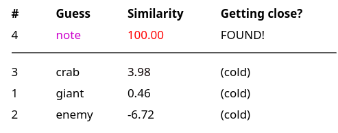
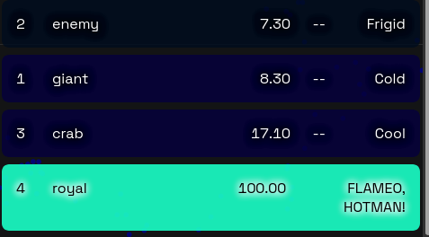
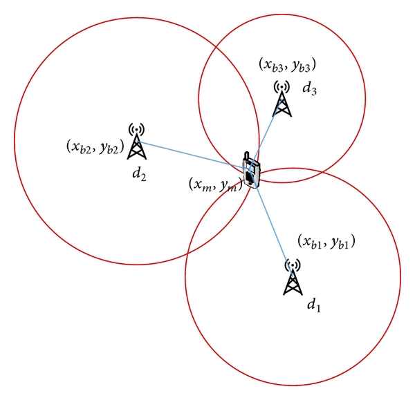

# semantle-crab
Solve [Semantle](https://semantle.novalis.org/) / [Pimantle](https://semantle.pimanrul.es/) in 4 moves. 

Guess "giant", then "enemy", then "crab". 

[Then put numbers in here and hit solve.](https://crab.manimino.com/)

### Solve Semantle

### Solve Pimantle:

### What? How does this work?

Triangulation. *d1* is "giant", *d2* is "enemy", *d3* is crab.

Typically only one word will be at the exact intersection of all three distances.

[(Image credit)](https://www.researchgate.net/publication/281753273_Mobile_Localization_Based_on_Received_Signal_Strength_and_Pearson's_Correlation_Coefficient)

### Can Semantle be solved in a less cheaty way?

[Yes. It's tricky though!]((https://www.github.com/manimino/semantle-solver))